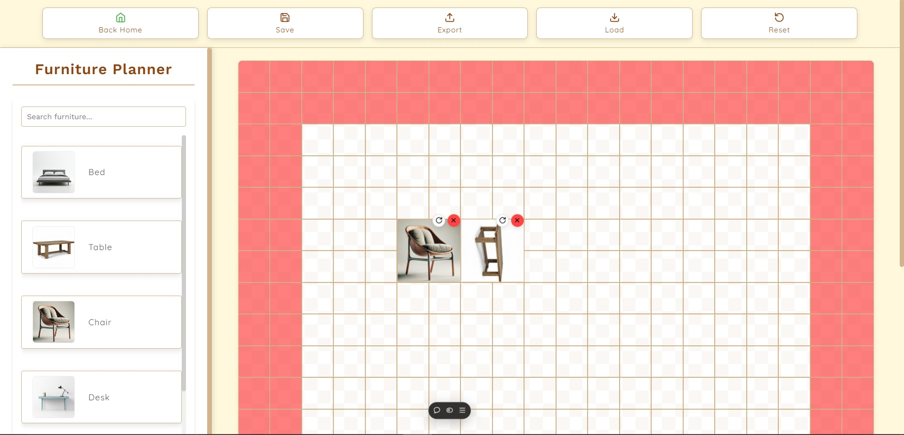
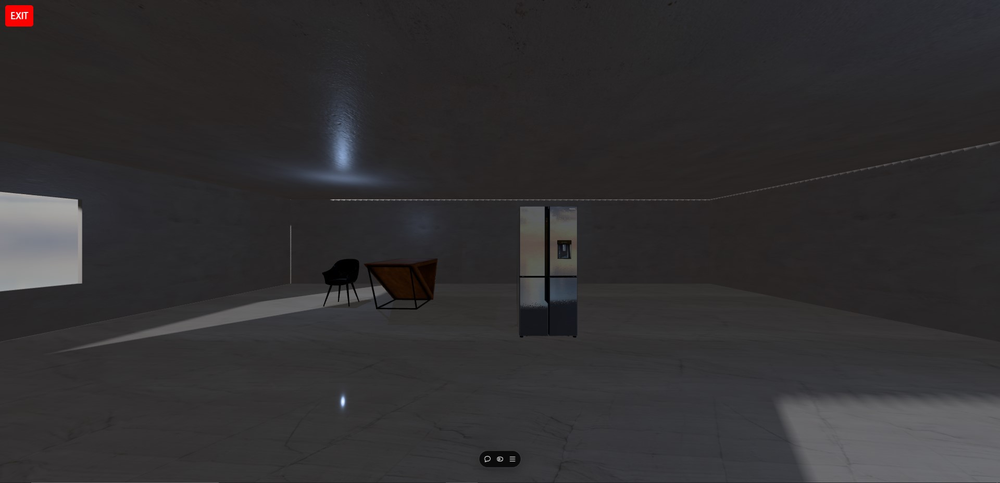

# Vision-Arch

**Vision-Arch** is a web application that transforms 2D architectural floor plans into interactive 3D spaces. Using an intuitive drag-and-drop interface, users can build a 2D plan, then explore the design in a detailed, 3D-rendered view with realistic models, textures, reflections, and shadows.

## Features

- **Upload 2D Plan**:
  - Use the drag-and-drop tool to place, move, and position elements in your 2D floor plan.
  - Build your custom 2D layout by arranging items in each room.
  - Once completed, you can save your design and return to the home page.
- **Explore Sample House**:
  - Visualize your created 2D plan in 3D with realistic textures, shadows, and lighting effects.
  - Experience a fully interactive 3D version of your custom layout with enhanced visuals.

## Installation

Follow these steps to set up Vision-Arch locally:

1. **Clone the Repository**

   ```bash
   git clone https://github.com/yourusername/Vision-Arch.git
   cd Vision-Arch
   ```

2. **Install Dependencies**

   ```bash
   npm install
   ```

3. **Run the Development Server**

   ```bash
   npm run dev
   ```

4. **Access the Application**
   - Open your browser and go to `http://localhost:3000` to view the app.

## Usage

1. **Start on the "Upload 2D Plan" Page**:

   - Use the drag-and-drop interface to build a 2D floor plan.
   - Position elements in each room as desired.

2. **View in 3D**:
   - Once you've designed your layout, click on **Back Home** to return to the main page.
   - Select **Explore Sample House** to see a 3D visualization of your floor plan, complete with lighting, textures, and shadows.

## Tech Stack

- **Frontend**: HTML, CSS, JavaScript, [React](https://reactjs.org/), Three JS
- **3D Rendering**: [Three.js](https://threejs.org/) for 3D modeling and visualization
- **Development Tools**: [Vite](https://vitejs.dev/) for fast builds

## Screenshots

1. **Upload 2D Plan Page**  
   

2. **Explore Sample House Page (3D View)**  
   

---

Enjoy turning your 2D plans into immersive 3D experiences with Vision-Arch!
